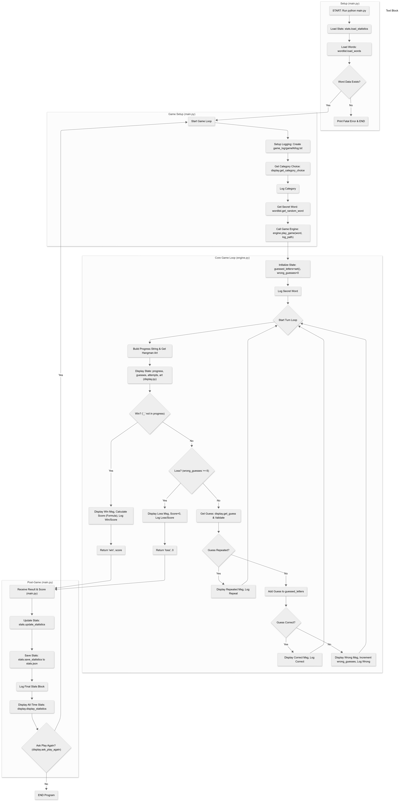

**************************Hangman Game (Python Assignment)*******************************

This is a modular, terminal-based Hangman game built in Python. The project is designed with a clean separation of concerns, persistent statistics, and detailed game logging per session.
How to Run the Game

1.  **Prerequisites:** Ensure to have Python 3 installed.
2.  **Navigate:** Open your terminal or command prompt and change the directory to the root `hangman_game/` folder.
3.  **Execute:** Run the game using the following command:
python main.py

************************ Project Structure *********************************

hangman_game/
├── main.py           
├── game/
│   ├── engine.py    
│   ├── wordlist.py  
│   ├── stats.py     
│   └── ascii_art.py  
├── ui/
│   └── display.py   
├── words/
│   └── categories/   
├── game_log/         
└── stats.json        

+++++++++++++++++++++ Features & Implementation Details ++++++++++++++++++++++++++

The assignment requirements as follows:

1. Core Gameplay & Validation 
Gameplay Loop: The core game is managed by the play_game function in game/engine.py.

Progress Tracking: The build_progress_string function generates the _ _ _ _ _ display, which is updated with each correct guess. The ui/display.py file's game_state function prints this progress, along with guessed letters and remaining attempts.

Letter Validation: All user input is handled by ui/display.py. The get_guess function uses .strip().lower() and .isalpha() in a while True loop to ensure correct word at once or a single letter or remaining joint letters are accepted.

Repeated Guesses: game/engine.py uses a set() called guessed_letters to store guesses. If a new guess is already in guessed_letters, the display.repeated_guess function is called, and the player is not penalized.

Win/Loss: The game loop checks for a win (if "_" not in progress_string:) or a loss (if wrong_guess >= max_wrong_guess:) on each turn.

2. Word Selection & Categories
Word Loading: The wordlist.load_words() function scans the hangman_game/words/categories directory for .txt files. It reads each file, cleans the words (strips whitespace, converts to lowercase), and stores them in a dictionary where the filename (e.g., "animals") is the key.

Category Selection: main.py calls display.get_category_choice, passing it the list of keys from the loaded word data. The user is presented with a numbered list and must pick one.

Word Selection: The chosen category string is passed to wordlist.get_random_word, which then uses random.choice() to select a single word from that category's list.

3. Scoring & Persistent Statistics 
This system is split into two parts:

Round Scoring: When a player wins, game/engine.py calls the score_cal function. This function applies the assignment's formula: (word_length * 10) - (wrong_guess * 5). A loss results in a score of 0.

Persistent Statistics: The game/stats.py module manages the stats.json file.

load_statistics(): Called once by main.py to read stats.json. If the file doesn't exist, it returns a default dictionary with all values at 0.

update_statistics(): Called by main.py after every game. It increments games_played, adds the round score to total_score, and updates wins or losses. It then recalculates the win_rate and average_score_per_game.

save_statistics(): Called by main.py to write the newly updated stats dictionary back to stats.json.

4. Logging 
A new, unique log file is created for every single game played.

Folder Creation: main.py's setup_logging function is called at the start of each game. It uses get_mx_game to scan the game_log/ directory and find the next available game number (e.g., game5). It then creates the folder game_log/game5/ and the empty log.txt file, dynamically.

Log Content:

main.py logs the game Timestamp, the chosen Category, and the full Final Statistics block at the end of the game.

game/engine.py logs the Word to be guessed bt the user, every Guess (noting if it was "Correct!", "Wrong", or "Repeated!"), the final Result (Win/Loss), and the Score for that round.

5. Play Again Loop & Bonus 
Play Again: main.py contains a main while True: loop that wraps the entire game session. After a game ends and stats are displayed, display.ask_play_again() is called. If the user enters 'n', the loop is broken, and the program exits and if the user press y then again the game starts.

ASCII Art (Bonus): game/ascii_art.py stores the 7 hangman drawings in the Hangman_stages list. The get_hangman_stage function provides the correct string based on the current wrong_guess count. engine.py passes this string to display.game_state to be printed each turn.

*************** Flow Chart of the Project ***************   

